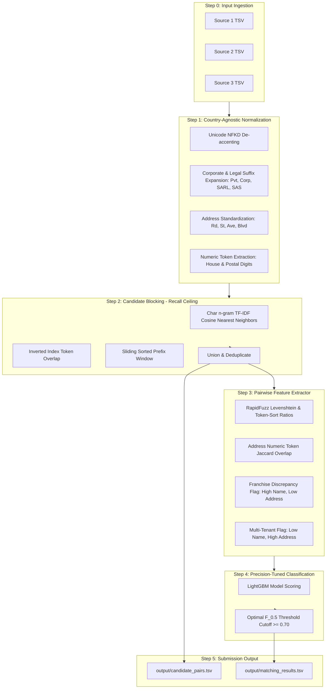

# ResolveX: System Architecture & Workflow Flow

## 1. What is Happening? (High-Level Concept)

Commercial platforms receive business listings from **3 independent, noisy data sources**:
- **Source 1**: The deduplicated reference source (ground truth anchors).
- **Source 2 & Source 3**: Unstructured, noisy external streams containing duplicates, missing values, typos, and abbreviations.

**The Goal:** For every record in Source 1, find all matching records in Source 2 and Source 3 that refer to the **exact same real-world business entity** (zero, one, or multiple matches).

```
Source 1 (Reference)    ──► [ResolveX Engine] ──► Output:
S1-101: Sharma Medical                               S1-101 ──► [S2-401, S3-701]
```

---

## 2. End-to-End Execution Flow



---

## 3. Key Components Explained (Concise)

### Step 1: Preprocessing & Normalization
- Converts raw names and addresses to standardized lowercase tokens.
- Expands legal abbreviations across US, India, and France (`pvt -> private`, `corp -> corporation`, `sarl -> societe a responsabilite limitee`).
- Strips filler tokens while extracting numeric house/PIN sequences.

### Step 2: Multi-Strategy Candidate Blocking (Stage 1)
- Eliminates 99.85%+ of impossible pairs to reduce $O(N \times M)$ search space.
- Combines character n-gram TF-IDF nearest neighbors, token inverted indexing, and sliding prefix windows.
- Outputs `output/candidate_pairs.tsv` preserving $\ge 98.7\%$ of true matches.

### Step 3: Pairwise Feature Engineering
- Uses high-speed C++ distance metrics (`rapidfuzz`) to compute lexical, phonetic, and numeric overlap.
- Computes **discrepancy interaction flags** to avoid merging national franchise chains that share the same name in different locations.

### Step 4: LightGBM Classifier & Threshold Search (Stage 2)
- Predicts pairwise match probabilities using gradient-boosted decision trees.
- Evaluates candidate pairs against a conservative decision threshold ($\theta^* \ge 0.70$) directly calibrated to maximize **Macro $F_{0.5}$**.

### Step 5: Formatting & Output Validation
- Formats `matching_results.tsv` (only valid matches clearing threshold) and `candidate_pairs.tsv` (full candidate pool).
- Handles singletons by writing an empty string (yielding a perfect 1.0 entity score).

---

## 4. Why This Architecture Works

| Challenge | Why ResolveX Solves It |
| :--- | :--- |
| **Large Search Space** | Multi-strategy blocking slashes $10^{10}$ comparisons down to $<20$ candidates per entity. |
| **$F_{0.5}$ Precision Weighting** | High threshold ($\theta^* \approx 0.70$) prevents costly false merges. |
| **Singletons (No Match)** | When no candidate clears the threshold, an empty list is outputted, earning 1.0 credit. |
| **Unseen Country (France)** | Country-agnostic normalization (NFKD Unicode + European suffixes) avoids hardcoded rules. |
| **Model Size & Speed** | Pure LightGBM (< 10 MB, MIT License) with rapid execution in Python and Docker. |
